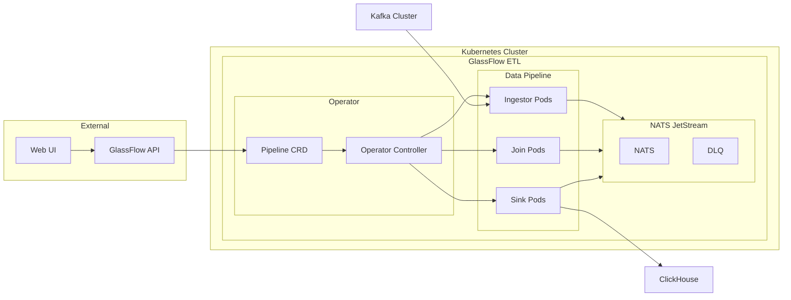

# GlassFlow ETL Kubernetes Operator

<div align="center">


[](https://github.com/glassflow/glassflow-etl-k8s-operator/actions)
[](https://github.com/glassflow/glassflow-etl-k8s-operator/releases)
[](LICENSE)
[](https://golang.org/)
[](https://kubernetes.io/)

[](mailto:help@glassflow.dev)
[](https://join.slack.com/t/glassflowhub/shared_invite/zt-349m7lenp-IFeKSGfQwpJfIiQ7oyFFKg)
[](https://calendly.com/glassflow)

**Enterprise-grade ETL pipeline orchestration for Kubernetes with seamless deduplication and joins**

[🚀 Quick Start](#-quick-start) • [📖 Documentation](#-documentation) • [🏗️ Architecture](#️-architecture) • [🤝 Contributing](#-contributing)

</div>

---

## 🎯 Overview

The **GlassFlow ETL Kubernetes Operator** is a production-ready Kubernetes operator that enables scalable, cloud-native data pipeline deployments. Built as a companion to the [GlassFlow ClickHouse ETL](https://github.com/glassflow/clickhouse-etl) project, it provides enterprise-grade data processing capabilities with advanced features like deduplication, temporal joins, and seamless pause/resume functionality.

### ✨ Key Features

- 🔄 **Pipeline Lifecycle Management** - Create, pause, resume, and terminate data pipelines
- 🎯 **Advanced Deduplication** - Built-in deduplication with configurable time windows
- 🔗 **Stream Joins** - Seamless joining of multiple data streams
- ⚡ **Kubernetes Native** - Full CRD-based pipeline management
- 🛡️ **Production Ready** - Enterprise-grade reliability and monitoring
- 📊 **Scalable Ingestor** - Efficiently reads from multiple Kafka partitions with horizontal scaling
- 🔧 **Helm Charts** - Easy deployment and configuration management

## 🏗️ Architecture



## 🚀 Quick Start

### Prerequisites

- **Kubernetes** 1.19+ cluster
- **Helm** 3.2.0+
- **kubectl** configured for your cluster
- **Kafka** (optional - can use external setup for development)
- **ClickHouse** (optional - can use external setup for development)

### Option 1: Helm Chart (Recommended)

Deploy using the complete GlassFlow ETL stack:

```bash
# Add GlassFlow Helm repository
helm repo add glassflow https://glassflow.github.io/charts
helm repo update

# Install complete GlassFlow ETL stack
helm install glassflow-etl glassflow/glassflow-etl
```

### Option 2: Operator Only

Deploy just the operator as a dependency:

```bash
# Install operator chart
helm install glassflow-operator glassflow/glassflow-operator
```

### Option 3: Manual Installation

```bash
# Clone the repository
git clone https://github.com/glassflow/glassflow-etl-k8s-operator.git
cd glassflow-etl-k8s-operator

# Install CRDs
make install

# Deploy operator
make deploy IMG=ghcr.io/glassflow/glassflow-etl-k8s-operator:latest
```

## 📖 Documentation

### Pipeline Management

Create pipelines using the GlassFlow ClickHouse ETL backend API. The operator will automatically create the corresponding Pipeline CRDs:

```yaml
apiVersion: etl.glassflow.io/v1alpha1
kind: Pipeline
metadata:
  name: user-events-pipeline
spec:
  pipeline_id: "user-events-v1"
  sources:
    type: kafka
    topics:
      - topic_name: "user-events"
        stream: "users"
        dedup_window: "1m"
        replicas: 2
  join:
    type: "temporal"
    stream: "joined-users"
    enabled: true
    replicas: 1
  sink:
    type: clickhouse
    replicas: 2
```

### Current Capabilities

| Feature | Status | Description |
|---------|--------|-------------|
| **Pipeline Creation** | ✅ | Deploy new ETL pipelines via CRD |
| **Pipeline Termination** | ✅ | Graceful shutdown and cleanup |
| **Pipeline Pausing** | ✅ | Temporarily halt data processing |
| **Pipeline Resuming** | ✅ | Resume paused pipelines |
| **Deduplication** | ✅ | Configurable time-window deduplication |
| **Stream Joins** | ✅ | Multi-stream data joining |
| **Auto-scaling** | ✅ | Horizontal pod autoscaling support |
| **Monitoring** | ✅ | Prometheus metrics integration |

## 🛠️ Development Setup

### Prerequisites

- **Go** 1.23+
- **Docker** 17.03+
- **kubectl** v1.11.3+
- **Kind** (for local testing)
- **NATS** (for messaging)

### Local Development

1. **Clone and setup**:
   ```bash
   git clone https://github.com/glassflow/glassflow-etl-k8s-operator.git
   cd glassflow-etl-k8s-operator
   make help  # See all available targets
   ```

2. **Install dependencies**:
   ```bash
   # Install development tools
   make controller-gen
   make kustomize
   make golangci-lint
   ```

3. **Start local infrastructure**:
   ```bash
   # Start NATS with JetStream (must run inside the cluster)
   helm repo add nats https://nats-io.github.io/k8s/helm/charts/
   helm install nats nats/nats --set nats.jetstream.enabled=true
   
   # Start Kafka (using Helm)
   helm repo add bitnami https://charts.bitnami.com/bitnami
   helm install kafka bitnami/kafka
   
   # Start ClickHouse (using Helm)
   helm install clickhouse bitnami/clickhouse
   
   # Or use external Kafka/ClickHouse for development
   ```

4. **Run the operator**:
   ```bash
   # Run locally (requires NATS running inside the cluster)
   make run
   ```

### Project Structure

This project was built using **Kubebuilder v4** and follows Kubernetes operator best practices:

```
├── api/v1alpha1/          # CRD definitions
├── internal/controller/    # Operator controller logic
├── internal/nats/         # NATS client integration
├── charts/                # Helm charts
├── config/                # Kustomize configurations
└── test/                  # Unit and e2e tests
```

### Development Tools

- **Kubebuilder** - Operator framework and scaffolding
- **Kustomize** - Kubernetes configuration management
- **Helmify** - Automatic Helm chart generation
- **GolangCI-Lint** - Code quality and linting

### Testing

```bash
# Run e2e tests (requires Kind cluster) - Primary testing method
make test-e2e

# Run unit tests (coverage being improved)
make test

# Run linter
make lint
```

## 📊 Chart Comparison

| Chart | Purpose | Components | Use Case |
|-------|---------|------------|----------|
| **glassflow-etl** | Complete ETL Platform | UI, API, Operator, NATS | Full-featured deployment |
| **glassflow-operator** | Operator Only | Operator, CRDs | Dependency for custom setups |

The **glassflow-etl** chart includes the complete platform with web UI, backend API, NATS, and the operator as dependencies. The **glassflow-operator** chart is designed as a dependency for the main chart or custom deployments.

## 🔗 Related Projects

- **[GlassFlow ClickHouse ETL](https://github.com/glassflow/clickhouse-etl)** - Core ETL engine and API
- **[GlassFlow Charts](https://github.com/glassflow/charts)** - Helm charts repository
- **[GlassFlow Documentation](https://docs.glassflow.dev)** - Complete documentation

## 🎥 Demo & Resources

- **Demo Video**: Coming soon
- **Live Demo**: [demo.glassflow.dev](https://demo.glassflow.dev)
- **Documentation**: [docs.glassflow.dev](https://docs.glassflow.dev)

## 🤝 Contributing

We welcome contributions! Please see our [Contributing Guide](CONTRIBUTING.md) for details.

### Development Workflow

1. Fork the repository
2. Create a feature branch
3. Make your changes
4. Run tests: `make test`
5. Run linter: `make lint`
6. Submit a pull request

## 📄 License

This project is licensed under the Apache License 2.0 - see the [LICENSE](LICENSE) file for details.

## 🆘 Support

- **Slack Community**: [GlassFlow Hub](https://join.slack.com/t/glassflowhub/shared_invite/zt-349m7lenp-IFeKSGfQwpJfIiQ7oyFFKg)
- **Documentation**: [docs.glassflow.dev](https://docs.glassflow.dev)
- **Issues**: [GitHub Issues](https://github.com/glassflow/glassflow-etl-k8s-operator/issues)
- **Discussions**: [GitHub Discussions](https://github.com/glassflow/glassflow-etl-k8s-operator/discussions)
- **Email**: help@glassflow.dev

---

<div align="center">

**Built with ❤️ by the GlassFlow Team**

[Website](https://glassflow.dev) • [Documentation](https://docs.glassflow.dev) • [GitHub](https://github.com/glassflow)

</div>