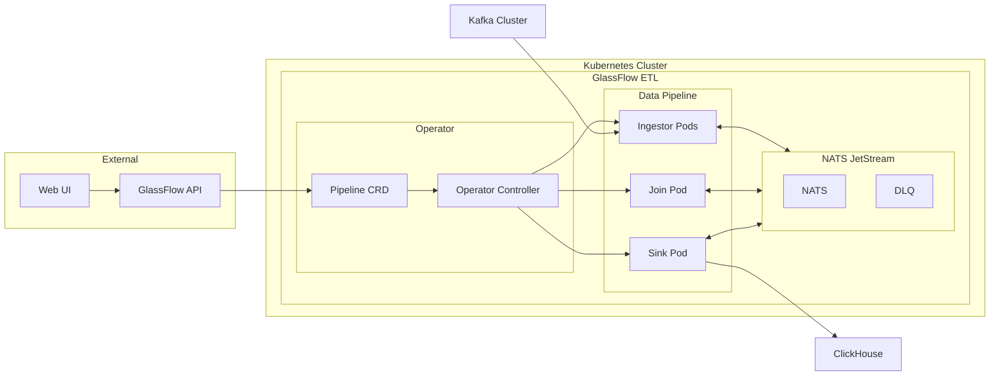

<p align="center">
  <h1>GlassFlow ETL Kubernetes Operator</h1>
</p>

<p align="center">
  
</p>

<p align="center">
  <a href="https://github.com/glassflow/glassflow-etl-k8s-operator/actions">
    
  </a>
  <a href="https://github.com/glassflow/glassflow-etl-k8s-operator/releases">
    
  </a>
  <a href="https://github.com/glassflow/clickhouse-etl/blob/main/LICENSE">
    
  </a>
  <a href="https://golang.org/">
    
  </a>
  <a href="https://kubernetes.io/">
    
  </a>
</p>

<p align="center">
  <a href="mailto:help@glassflow.dev">
    
  </a>
  <a href="https://join.slack.com/t/glassflowhub/shared_invite/zt-349m7lenp-IFeKSGfQwpJfIiQ7oyFFKg">
    
  </a>
  <a href="https://calendly.com/glassflow">
    
  </a>
</p>

<p align="center">
  <strong>Enterprise-grade ETL pipeline orchestration for Kubernetes with seamless deduplication and joins</strong>
</p>

<p align="center">
  <a href="#-quick-start">🚀 Quick Start</a> • 
  <a href="#-documentation">📖 Documentation</a> • 
  <a href="#️-architecture">🏗️ Architecture</a> • 
  <a href="#-contributing">🤝 Contributing</a>
</p>

---

## 🎯 Overview

The **GlassFlow ETL Kubernetes Operator** is a production-ready Kubernetes operator that enables scalable, cloud-native data pipeline deployments. Built as a companion to the [GlassFlow ClickHouse ETL](https://github.com/glassflow/clickhouse-etl) project, it provides enterprise-grade data processing capabilities with advanced features like deduplication, temporal joins, and seamless pause/resume functionality.

### ✨ Key Features

- 🔄 **Pipeline Lifecycle Management** - Create, pause, resume, and terminate data pipelines
- 🎯 **Advanced Deduplication** - Built-in deduplication with configurable time windows
- 🔗 **Stream Joins** - Seamless joining of multiple data streams
- ⚡ **Kubernetes Native** - Full CRD-based pipeline management
- 🛡️ **Production Ready** - Enterprise-grade reliability and monitoring
- 📊 **Scalable Ingestor** - Efficiently reads from multiple Kafka partitions with horizontal scaling
- 🔧 **Helm Charts** - Easy deployment and configuration management

## 🏗️ Architecture



## 🚀 Quick Start

### Prerequisites

- **Kubernetes** 1.19+ cluster
- **Helm** 3.2.0+
- **kubectl** configured for your cluster
- **Kafka** (optional - can use external setup for development)
- **ClickHouse** (optional - can use external setup for development)

### Option 1: Helm Chart (Recommended)

Deploy using the complete GlassFlow ETL stack from the [GlassFlow Charts repository](https://github.com/glassflow/charts):

```bash
# Add GlassFlow Helm repository
helm repo add glassflow https://glassflow.github.io/charts
helm repo update

# Install complete GlassFlow ETL stack
helm install glassflow-etl glassflow/glassflow-etl
```

### Option 2: Operator Only

Deploy just the operator as a dependency:

```bash
# Install operator chart
helm install glassflow-operator glassflow/glassflow-operator
```

### Option 3: Manual Installation

```bash
# Clone the repository
git clone https://github.com/glassflow/glassflow-etl-k8s-operator.git
cd glassflow-etl-k8s-operator

# Install CRDs
make install

# Deploy operator
make deploy IMG=ghcr.io/glassflow/glassflow-etl-k8s-operator:latest
```

## 📖 Documentation

### Pipeline Management

Create pipelines using the GlassFlow ClickHouse ETL backend API. The operator will automatically create the corresponding Pipeline CRDs. Here's an example of what the generated CRD will look like:

```yaml
apiVersion: etl.glassflow.io/v1alpha1
kind: Pipeline
metadata:
  name: user-events-pipeline
spec:
  pipeline_id: "user-events-v1"
  config: "pipeline-config"
  dlq: "dead-letter-queue"
  sources:
    type: kafka
    topics:
      - topic_name: "user-events"
        stream: "users"
        dedup_window: 60000000000  # 1 minute in nanoseconds
  join:
    type: "temporal"
    stream: "joined-users"
    enabled: true
  sink: "clickhouse"
```

### Current Capabilities

| Feature | Status | Description |
|---------|--------|-------------|
| **Pipeline Creation** | ✅ | Deploy new ETL pipelines via CRD |
| **Pipeline Termination** | ✅ | Graceful shutdown and cleanup |
| **Pipeline Pausing** | ✅ | Temporarily halt data processing |
| **Pipeline Resuming** | ✅ | Resume paused pipelines |
| **Deduplication** | ✅ | Configurable time-window deduplication |
| **Stream Joins** | ✅ | Multi-stream data joining |
| **Auto-scaling** | ✅ | Horizontal pod autoscaling / ingestor replicas support |
| **Monitoring** | ✅ | Prometheus metrics integration |

## 🛠️ Development Setup

### Prerequisites

- **Go** 1.23+
- **Docker** 17.03+
- **kubectl** v1.11.3+
- **Kind** (for local testing)
- **NATS** (for messaging)

### Local Development

1. **Clone and setup**:
   ```bash
   git clone https://github.com/glassflow/glassflow-etl-k8s-operator.git
   cd glassflow-etl-k8s-operator
   make help  # See all available targets
   ```

2. **Install dependencies**:
   ```bash
   # Install development tools
   make controller-gen
   make kustomize
   make golangci-lint
   ```

3. **Start local infrastructure**:
   ```bash
   # Start NATS with JetStream (must run inside the cluster)
   helm repo add nats https://nats-io.github.io/k8s/helm/charts/
   helm install nats nats/nats --set nats.jetstream.enabled=true
   
   # Start Kafka (using Helm)
   helm repo add bitnami https://charts.bitnami.com/bitnami
   helm install kafka bitnami/kafka
   
   # Start ClickHouse (using Helm)
   helm install clickhouse bitnami/clickhouse
   
   # Or use external Kafka/ClickHouse for development
   ```

4. **Run the operator**:
   ```bash
   # Run locally (requires NATS running inside the cluster)
   make run
   ```

### Project Structure

This project was built using **Kubebuilder v4** and follows Kubernetes operator best practices:

```
├── api/v1alpha1/          # CRD definitions
├── internal/controller/    # Operator controller logic
├── internal/nats/         # NATS client integration
├── charts/                # Helm charts
├── config/                # Kustomize configurations
└── test/                  # Unit and e2e tests
```

### Development Tools

- **Kubebuilder** - Operator framework and scaffolding
- **Kustomize** - Kubernetes configuration management
- **Helmify** - Automatic Helm chart generation
- **GolangCI-Lint** - Code quality and linting

### Testing

```bash
# Run e2e tests (requires Kind cluster) - Primary testing method
make test-e2e

# Run unit tests (coverage being improved)
make test

# Run linter
make lint
```

## 📊 Chart Comparison

| Chart | Purpose | Components | Use Case |
|-------|---------|------------|----------|
| **glassflow-etl** | Complete ETL Platform | UI, API, Operator, NATS | Full-featured deployment |
| **glassflow-operator** | Operator Only | Operator, CRDs | Dependency for custom setups |

The **glassflow-etl** chart includes the complete platform with web UI, backend API, NATS, and the operator as dependencies. The **glassflow-operator** chart is designed as a dependency for the main chart or custom deployments.

## 🔗 Related Projects

- **[GlassFlow ClickHouse ETL](https://github.com/glassflow/clickhouse-etl)** - Core ETL engine and API
- **[GlassFlow Charts](https://github.com/glassflow/charts)** - Helm charts repository
- **[GlassFlow Documentation](https://docs.glassflow.dev)** - Complete documentation

## 🎥 Demo & Resources

- **Demo Video**: Coming soon
- **Live Demo**: [demo.glassflow.dev](https://demo.glassflow.dev)
- **Documentation**: [docs.glassflow.dev](https://docs.glassflow.dev)

## 🤝 Contributing

We welcome contributions!

### Development Workflow

1. Fork the repository
2. Create a feature branch
3. Make your changes
4. Run tests: `make test`
5. Run linter: `make lint`
6. Submit a pull request

## 📄 License

This project is licensed under the Apache License 2.0 - see the [clickhouse-etl LICENSE](https://github.com/glassflow/clickhouse-etl/blob/main/LICENSE) file for details.

## 🆘 Support

- **Slack Community**: [GlassFlow Hub](https://join.slack.com/t/glassflowhub/shared_invite/zt-349m7lenp-IFeKSGfQwpJfIiQ7oyFFKg)
- **Documentation**: [docs.glassflow.dev](https://docs.glassflow.dev)
- **Issues**: [GitHub Issues](https://github.com/glassflow/glassflow-etl-k8s-operator/issues)
- **Discussions**: [GitHub Discussions](https://github.com/glassflow/glassflow-etl-k8s-operator/discussions)
- **Email**: help@glassflow.dev

---

<p align="center">
  <strong>Built by GlassFlow Team</strong>
</p>

<p align="center">
  <a href="https://glassflow.dev">Website</a> • 
  <a href="https://docs.glassflow.dev">Documentation</a> • 
  <a href="https://github.com/glassflow">GitHub</a>
</p>